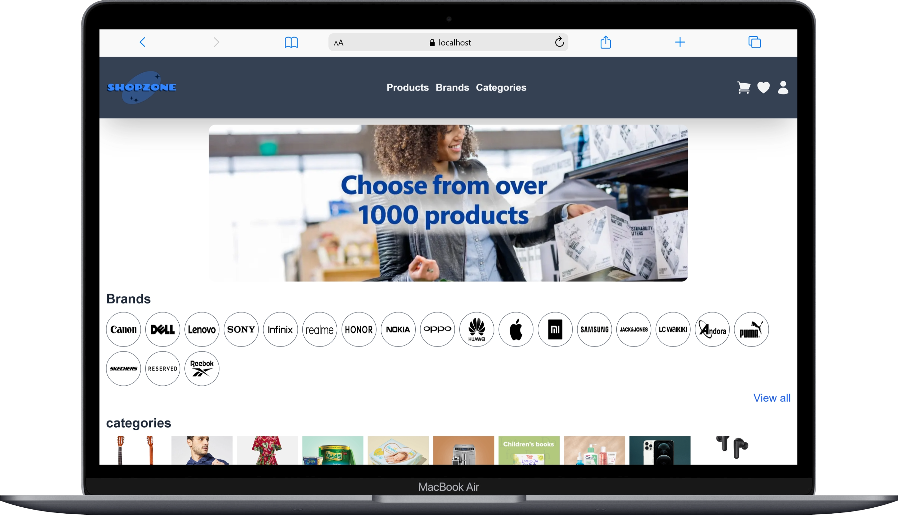
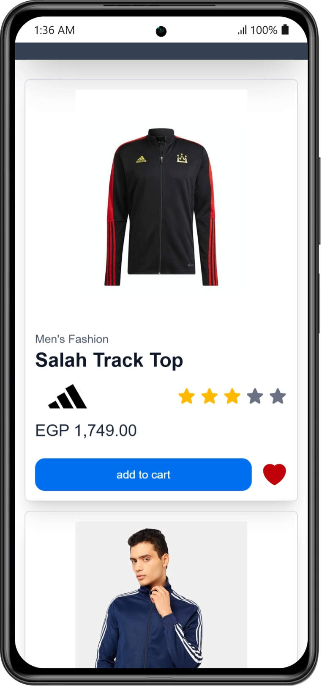
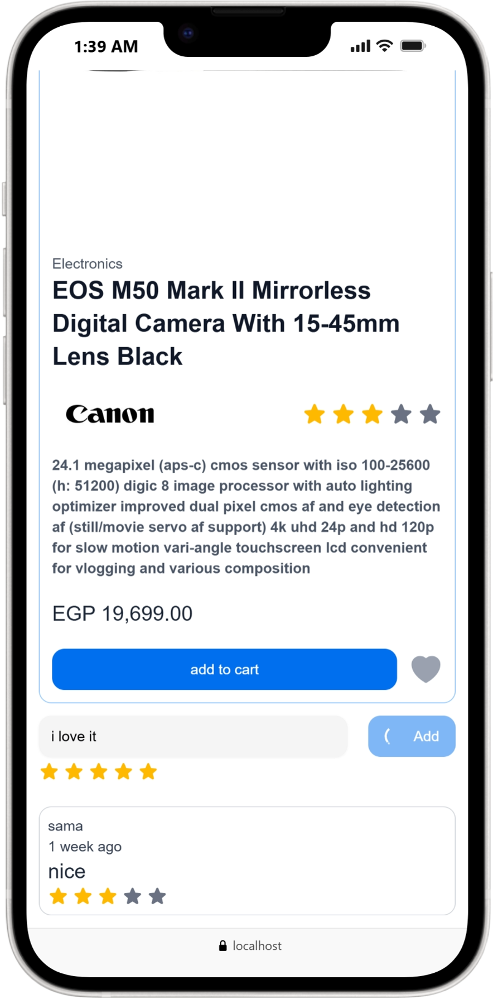

# ShopZone

ShopZone is a modern E-commerce Frontend Application built with Next.js
It provides a complete shopping experience including authentication,
products browsing, cart management, wishlist, reviews, and order
creation.

##  Project Overview

ShopZone is a scalable and well-structured frontend application that
consumes a full E-commerce REST API.

The project focuses on: - Clean Architecture - Scalable Folder
Structure - Reusable Components - Optimized State Management - Modern
UI/UX Experience

## Tech Stack

### Frontend

-   Next.js 16 (App Router)
-   React 19
-   TypeScript

### UI & Styling

-   HeroUI
-   Framer Motion (animations)

### Forms & Validation

-   React Hook Form
-   Zod (schema validation)
-   @hookform/resolvers

### State Management & Data Fetching

-   TanStack React Query (v5)
-   React Context API

### Utilities

-   js-cookie

------------------------------------------------------------------------

## Folder Structure

    app/
    │
    ├── _components      # Reusable UI components
    ├── _interfaces      # TypeScript interfaces
    ├── _schema          # Zod validation schemas
    ├── _services        # API service layer (fetch abstraction)
    ├── (pages)          # Application pages
    ├── assets           # Static assets
    ├── context          # Global state management

This structure keeps the application clean, modular, and scalable.

------------------------------------------------------------------------

##  Features

## Categories & Brands
- **View all categories** – Browse all available categories.  
- **View a specific category** – Click on a category to see its products.  
- **View all brands** – Browse all available brands.  
- **View a specific brand** – Click on a brand to see products from that brand only.  

##  Products
- **View all products** – Browse all products.  
- **View a specific product** – Click on a product to see details, images, price, and reviews.  

##  Authentication
- **User Signup** – Register a new account easily.  
- **User Signin** – Log in to access all features.  
- **Cookie-based authentication** – Stay logged in securely.  

##  Wishlist
- **Add product to wishlist** – Click any product to add it to your wishlist.  
- **Remove product from wishlist** – Remove products from your wishlist.  
- **View your wishlist** – See all products you have added to your favorites.  

## Cart
- **Add product to cart** – Add products to your shopping cart.  
- **View your cart** – See all products in your cart.  
- **Update product quantity** – Change the quantity of any product in your cart.  
- **Remove product from cart** – Remove any product from your cart.  
- **Clear cart** – Empty all products from your cart at once.  

## Reviews
- **Create review** – Share your opinion on any product.  
- **View reviews for a product** – See ratings and feedback from other users.  
- **View all reviews** – Browse all reviews.  
- **Update/Delete review** – Edit or delete your own review (admin can delete any review).  

##  Orders
- **Create cash order from cart** – Checkout all cart products with cash payment.  
- **Create cash order** – Checkout a single product with cash payment.  
- **View your orders** – See all orders you have made.  

##  Screenshots

###  Desktop
  
  
  
  

---

###  Mobile & Tablet
  
  
  

## Environment Variables

- This project requires a **base URL** to work properly. You need to set it in a `.env` file.
- Create a `.env` file in the root of your project (if it doesn’t exist) and add:
- PASS_URL=your base url

<h2>
  <a href="https://e-commerce-next-app-murex.vercel.app/" target="_blank">Click here to see the Live Demo 🌐</a>
</h2>

